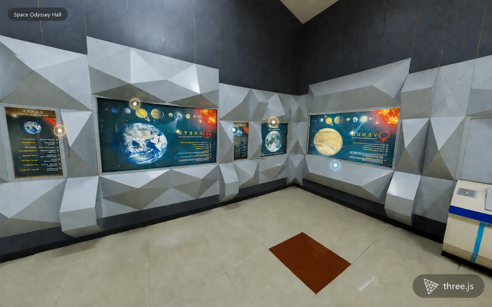

# Science City Kolkata — Walk Through It in 360°

Step inside Science City Kolkata, a real museum and science park, right from your browser. Look around in every direction, walk from room to room by clicking glowing dots, and explore an actual planetarium-style exhibit hall — no headset, no app, just a browser tab.

## Try it

- **Drag** with your mouse (or swipe on mobile) to look around — up, down, left, right, a full 360°.
- **Scroll** to zoom in and out.
- **Click a glowing marker** to walk into the next room.

There are three scenes to explore:

- **Science City Kolkata — Exterior**, the entrance view outside the museum, with a marker pointing toward the Geodesic Dome Theatre and a door into the Space Odyssey Hall.
- **Space Odyssey Hall**, a planetarium-style exhibit room with planet displays and info markers to look closer at.
- A second view of the **Space Odyssey Hall**, one step further into the room, so you can keep exploring deeper.

## Why I built this

In my day job, I've already shipped a production 360° virtual tour feature for a real-estate app — the kind where you click through a building room by room. I built that one using a ready-made panorama library that handled all the 3D work behind the scenes for me.

This project is me redoing that same idea, but from scratch, using the real 3D engine underneath — Three.js — directly, instead of a plug-and-play library. I wanted to prove to myself (and to anyone reviewing my work) that I actually understand how the 3D pieces fit together, not just how to configure someone else's package.

## Built with

- **React** — the UI framework the whole app's interface is built in.
- **Vite** — the tool that runs the app locally and bundles it for deployment.
- **Three.js** — the 3D engine that renders everything you see and handles the camera and interactions.
- **react-three-fiber** — lets Three.js scenes be written as React components, so the 3D world fits naturally into the rest of the app.
- **react-three-drei** — a helper toolkit on top of react-three-fiber with ready-made building blocks for common 3D needs.

## More of The Technical Background

I've shipped a production 360° panorama viewer with interactive hotspots before, in a React real-estate app, using [`@egjs/react-view360`](https://github.com/naver/egjs-view360) — a library that wraps Three.js under the hood. That project taught me the *domain*: equirectangular panoramas, yaw/pitch hotspot placement, camera zoom-as-field-of-view, scene-to-scene navigation, defensive handling of texture load failures.

What it didn't teach me was Three.js itself — view360 never required touching the Three.js API directly. This project is that translation: the same domain knowledge, rebuilt on raw Three.js, so the hands-on parts (camera math, raycasting, GPU resource management) are mine rather than a library's.

## What's actually hand-rolled here (not just react-three-fiber JSX)

A few pieces intentionally go beneath react-three-fiber's declarative layer, since that's the part a wrapper library never required:

- **`src/utils/sphericalMath.js`** — converts a yaw/pitch angle pair (degrees) into a 3D point on a sphere, by hand. This is the same math a compass and a protractor would use: it's how every hotspot marker and the camera's initial facing direction get placed in 3D space.
- **`src/components/HotspotLayer.jsx`** — hotspot clicking uses a `THREE.Raycaster`, not a DOM click handler. A mesh floating in 3D space has no native "onClick" — a raycaster casts an invisible line from the camera through wherever the pointer is, each frame, and reports which object it hits first. That's how hovering and clicking a marker actually gets detected. It also has to tell a click apart from the start of a drag (both start with the same pointer-down), by checking whether the pointer moved before it lifted.
- **`src/components/PanoramaSphere.jsx`** — scene transitions crossfade rather than hard-cutting. Every texture handed to this component becomes its own fading layer (its own sphere + material); the newest one fades in while older ones fade out and get disposed once they're no longer visible. This also means the component is directly responsible for freeing GPU texture memory once a layer is done with it — that's not automatic for anything loaded outside of JSX.
- **`src/components/CameraRig.jsx`** — "zooming" is implemented as narrowing the camera's field of view (via a manual scroll-wheel handler), not moving the camera closer to anything — the camera never leaves the center of the panorama sphere, exactly like the production view360 viewer's zoom behavior.

## Techniques used, in plain terms

- **Equirectangular panorama sphere**: a photo taken with a 360° camera gets wrapped around the inside of a sphere. The camera sits at the sphere's center; "looking around" is just rotating the camera in place.
- **Partial sphere coverage**: real photographed panoramas (unlike synthetic renders) usually don't capture the very top and bottom (zenith/nadir) — they cover a horizontal band. The sphere geometry here is built to match each photo's actual vertical coverage, so the image isn't stretched to fill a full sphere it was never shot to cover.
- **Raycasting**: see above — the mechanism behind clicking a hotspot.
- **Crossfade via layered materials**: rather than a shader effect, the crossfade is done by literally rendering two overlapping spheres and animating their material opacity in opposite directions.
- **Manual GPU resource cleanup**: textures are a GPU resource. Anything created outside of JSX (this app loads panorama images imperatively via `THREE.TextureLoader`, so it can control exactly when a load is stale) has to be disposed manually once it's no longer needed, or it leaks.

## Image credits

Panorama photos are from Science City, Kolkata.
